# Concurrencia en Go

## Teoría, Implementación y Patrones

<div class="pt-12">
  <span @click="$slidev.nav.next" class="px-2 py-1 rounded cursor-pointer" hover:bg="white op-10">
    Presiona espacio para continuar <carbon:arrow-right class="inline"/>
  </span>
</div>

---
transition: fade-out
---

# ¿Qué vamos a ver?

<v-clicks>

- **Fundamentos** - Concurrencia vs Paralelismo
- **CSP** - Communicating Sequential Processes
- **Goroutines y Channels** - Los bloques fundamentales
- **Runtime Scheduler** - La magia detrás de escena
- **Patrones** - Soluciones idiomáticas
- **Context** - Control del ciclo de vida

</v-clicks>

---
layout: center
class: text-center
---

# Parte I: Fundamentos

## Conceptos esenciales de programación concurrente

---

# Concurrencia vs Paralelismo

<div class="grid grid-cols-2 gap-4">

<div v-click>

## Concurrencia
- **Concepto estructural**
- Lidiar con muchas tareas a la vez
- Composición independiente
- Puede ejecutarse en un solo core

</div>

<div v-click>

## Paralelismo
- **Concepto de ejecución**
- Hacer muchas cosas a la vez
- Requiere múltiples cores
- Ejecución simultánea real

</div>

</div>

<div v-click class="mt-8 text-center text-gray-400">

*"Concurrency is about dealing with lots of things at once.*
*Parallelism is about doing lots of things at once."*
— Rob Pike

</div>

---

# Desafíos en Programación Concurrente

<v-clicks>

## Race Conditions
Cuando el resultado depende del orden impredecible de eventos

## Deadlocks  
Procesos bloqueados esperando recursos que otros tienen

## Livelocks
Procesos activos pero sin progreso real

## Starvation
Un proceso nunca obtiene los recursos que necesita

</v-clicks>

---

# Modelos de Concurrencia

<div class="text-sm">

| Característica | Memoria Compartida | CSP | Actor Model |
|---|---|---|---|
| **Abstracción** | Threads, Locks | Goroutines, Channels | Actors, Mailboxes |
| **Estado** | Explícitamente compartido | Confinado, se comparte vía mensajes | Encapsulado en actors |
| **Comunicación** | Indirecta (memoria) | Síncrona/Asíncrona (channels) | Asíncrona (mensajes) |
| **Acoplamiento** | Alto | Bajo | Muy Bajo |

</div>

<v-click>

<div class="mt-8 text-center">

Go eligió **CSP** para simplicidad y seguridad

</div>

</v-click>

---
layout: center
class: text-center
---

# Parte II: El Modelo Go

## CSP en la práctica

---

# La Filosofía de Go

<div class="text-2xl font-bold text-center my-12">

"Don't communicate by sharing memory;
<span v-mark.underline.orange>share memory by communicating</span>"

</div>

<v-clicks>

## Modelo Tradicional
Los threads acceden a memoria compartida protegida por locks

## Modelo Go
Los valores se envían entre goroutines a través de channels

</v-clicks>

---

# Goroutines

## La unidad de ejecución concurrente

```go
// Lanzar una goroutine es trivial
go doSomething()

// Con función anónima
go func(msg string) {
    fmt.Println(msg)
}("hello")
```

<v-clicks>

### Características clave:
- **Ligeras**: Stack inicial de ~2KB (vs MB en threads OS)
- **Escalables**: Millones de goroutines simultáneas
- **Gestionadas**: El runtime las multiplexa sobre threads OS

</v-clicks>

---

# Channels

## Los conductos de comunicación

```go
// Crear channels
ch := make(chan int)        // Unbuffered
ch := make(chan string, 10) // Buffered

// Operaciones básicas
ch <- 42      // Enviar
value := <-ch // Recibir
close(ch)     // Cerrar
```

<v-clicks>

### Unbuffered vs Buffered:
- **Unbuffered**: Sincronización directa (rendezvous)
- **Buffered**: Desacoplamiento temporal con capacidad

</v-clicks>

---

# Select Statement

## Multiplexación de operaciones

```go
select {
case msg1 := <-ch1:
    fmt.Println("received", msg1)
case ch2 <- msg2:
    fmt.Println("sent", msg2)
case <-time.After(1 * time.Second):
    fmt.Println("timeout")
default:
    fmt.Println("no communication ready")
}
```

<v-click>

El `select` permite:
- Esperar en múltiples channels
- Implementar timeouts
- Operaciones no bloqueantes con `default`

</v-click>

---
layout: center
class: text-center
---

# Parte III: El Runtime Scheduler

## La maquinaria que hace posible la magia

---

# Arquitectura M:P:G

## El modelo de tres entidades


<div class="text-center mt-4">

El scheduler multiplexa **Goroutines** en **Machines** a través de **Processors**

</div>

---

# G - Goroutine

## La unidad de trabajo

<v-clicks>

- **Stack dinámico**: Comienza con ~2KB, crece según necesidad
- **Estado guardado**: Instruction pointer, registros, stack
- **Información de scheduling**: Estado (runnable, running, waiting)
- **Canales asociados**: Referencias a channels donde espera

</v-clicks>

<v-click>

```go
// Cada vez que escribes esto:
go func() {
    // trabajo...
}()
// Se crea un objeto 'g' en el runtime
```

</v-click>

---

# M - Machine Thread

## El ejecutor real

<v-clicks>

- **Thread del OS**: Contexto de ejecución del kernel
- **Stack fijo**: ~8MB en sistemas Unix
- **Costo de cambio**: ~1-10μs para context switch del OS
- **Pool de threads**: El runtime mantiene un pool de Ms idle

</v-clicks>

<v-click>

<div class="mt-8 p-4 bg-gray-100 rounded">

💡 Go limita el número de Ms activos para evitar sobrecarga del OS

</div>

</v-click>

---

# P - Processor

## El contexto de scheduling

<v-clicks>

- **Número fijo**: GOMAXPROCS (default = núm. de CPUs)
- **Local Run Queue**: Cola privada de Gs listos (~256 max)
- **Cache de mcache**: Memoria local para allocations
- **Recursos de runtime**: Timers, network poller refs

</v-clicks>

<v-click>

```go
// Configurar el número de Ps
runtime.GOMAXPROCS(4) // 4 procesadores lógicos
```

</v-click>

---

# Work Stealing

## Algoritmo de búsqueda de trabajo

```mermaid {scale: 0.5}
flowchart LR
    Start[Buscar] --> Local[LRQ]
    Local -->|vacía| Global[GRQ]
    Global -->|vacía| Steal[Robar]
    Steal -->|falla| Poll[Poller]
    Local -->|ok| Exec[Ejecutar]
    Global -->|ok| Exec
    Steal -->|ok| Exec
    Poll -->|ok| Exec
```



---

# Detalles del Work Stealing

## Optimizaciones del algoritmo

<v-clicks>

### Local Run Queue primero
- Acceso sin locks
- Mejor localidad de cache
- Operación más rápida

### Global Run Queue (1/61)
- Número primo evita sincronización periódica
- Balance entre fairness y contención
- Evita que GRQ sea bottleneck

### Robo de trabajo
- Selección aleatoria de víctima
- Roba la mitad de las Gs
- Distribuye carga uniformemente

</v-clicks>

---

# Manejo de Bloqueos

## System calls bloqueantes


---

# Network Poller

## I/O asíncrono integrado

<v-clicks>

### Mecanismo
- Usa epoll (Linux), kqueue (BSD), IOCP (Windows)
- Thread dedicado para polling
- Goroutines "estacionadas" no bloquean Ms

### Flujo
1. G intenta I/O en socket non-blocking
2. Si bloquearía → G se estaciona con poller
3. M queda libre para ejecutar otras Gs
4. Cuando I/O está listo → G vuelve a run queue

### Ventaja
- Miles de conexiones concurrentes
- Sin thread por conexión
- Escalabilidad masiva para servidores

</v-clicks>

---

# Preemption Asíncrona

## Equidad desde Go 1.14

<v-clicks>

### Problema anterior
- Scheduling cooperativo
- Loops tight podían monopolizar P
- Starvation de otras goroutines

### Solución actual
- Timer por goroutine (10ms)
- Señal asíncrona si excede tiempo
- Fuerza yield y re-queue

</v-clicks>

<v-click>

```go
// Este loop ya no puede bloquear otras goroutines
for {
    // trabajo intensivo en CPU
    calculatePi()
}
// El runtime lo interrumpirá cada 10ms
```

</v-click>

---
layout: center
class: text-center
---

# Parte IV: Patrones de Concurrencia

## Soluciones idiomáticas en Go

---

# Pipeline Pattern

## Procesamiento en etapas secuenciales


<v-clicks>

### Características
- Cada etapa es una goroutine independiente
- Channels conectan las etapas
- Datos fluyen unidireccionalmente
- Fácil de componer y extender

</v-clicks>

---

# Pipeline: Código

## Implementación del patrón

```go
// Etapa generadora
func generator(nums...int) <-chan int {
    out := make(chan int)
    go func() {
        for _, n := range nums {
            out <- n
        }
        close(out)
    }()
    return out
}

// Etapa transformadora
func square(in <-chan int) <-chan int {
    out := make(chan int)
    go func() {
        for n := range in {
            out <- n * n
        }
        close(out)
    }()
    return out
}
```

---

# Fan-Out, Fan-In Pattern

## Paralelización dinámica


<v-clicks>

- **Fan-out**: Distribuir trabajo entre workers
- **Fan-in**: Consolidar resultados en un canal
- **Uso**: Paralelizar etapas costosas del pipeline

</v-clicks>

---

# Fan-In: Código

## Consolidación de múltiples channels

```go
// Fan-in: consolidar múltiples channels
func merge(cs...<-chan int) <-chan int {
    var wg sync.WaitGroup
    out := make(chan int)
    
    output := func(c <-chan int) {
        defer wg.Done()
        for n := range c {
            out <- n
        }
    }
    
    wg.Add(len(cs))
    for _, c := range cs {
        go output(c)
    }
    
    go func() {
        wg.Wait()
        close(out)
    }()
    return out
}
```

---

# Worker Pool Pattern

## Control de concurrencia limitada


<v-clicks>

- **Número fijo de workers**: Limita paralelismo
- **Cola de trabajos compartida**: Distribución automática
- **Ideal para**: APIs, DBs, recursos limitados

</v-clicks>

---

# Worker Pool: Código

## Implementación con channels

```go
func worker(id int, jobs <-chan int, results chan<- int) {
    for j := range jobs {
        fmt.Printf("Worker %d procesando job %d\n", id, j)
        // Simular trabajo costoso
        time.Sleep(time.Second)
        results <- j * 2
    }
}

func main() {
    const numWorkers = 3
    jobs := make(chan int, 100)
    results := make(chan int, 100)
    
    // Iniciar workers
    for w := 1; w <= numWorkers; w++ {
        go worker(w, jobs, results)
    }
    
    // Enviar trabajos y recolectar resultados...
}
```

---

# Rate Limiting Pattern

## Control de throughput


<v-clicks>

### Estrategias
- **Ticker**: Tasa fija constante
- **Token Bucket**: Permite ráfagas controladas
- **Sliding Window**: Límite por ventana de tiempo

</v-clicks>

---

# Rate Limiting: Ticker

## Implementación con tasa fija

```go
// Limitación simple con ticker
limiter := time.NewTicker(200 * time.Millisecond)
defer limiter.Stop()

for req := range requests {
    <-limiter.C // Esperar hasta el próximo tick
    go processRequest(req)
}
```

<v-click>

### Características
- Espaciado uniforme entre operaciones
- Fácil de implementar
- No permite ráfagas

</v-click>

---

# Rate Limiting: Token Bucket

## Ráfagas controladas

```go
// Token bucket para ráfagas ocasionales
tokens := make(chan struct{}, 3) // Máximo 3 tokens

// Llenar bucket inicialmente
for i := 0; i < 3; i++ {
    tokens <- struct{}{}
}

// Reponer tokens periódicamente
go func() {
    ticker := time.NewTicker(time.Second)
    for range ticker.C {
        select {
        case tokens <- struct{}{}:
        default: // Bucket lleno, no agregar más
        }
    }
}()

// Usar tokens para procesar
for req := range requests {
    <-tokens // Consumir un token
    go processRequest(req)
}
```

---
layout: center
class: text-center
---

# Parte V: Context Package

## Gestión del ciclo de vida

---

# Context para Control

## Cancelación, deadlines y valores

```go
func worker(ctx context.Context) {
    for {
        select {
        case <-ctx.Done():
            fmt.Println("Worker cancelled")
            return
        default:
            // Hacer trabajo...
            time.Sleep(500 * time.Millisecond)
        }
    }
}

func main() {
    ctx, cancel := context.WithCancel(context.Background())
    go worker(ctx)
    
    time.Sleep(2 * time.Second)
    cancel() // Señalar al worker que pare
}
```

---

# Timeouts y Deadlines

## Límites de tiempo en operaciones

```go
func slowOperation(ctx context.Context) (string, error) {
    select {
    case <-time.After(5 * time.Second):
        return "result", nil
    case <-ctx.Done():
        return "", ctx.Err() // DeadlineExceeded
    }
}

func main() {
    // Timeout de 3 segundos
    ctx, cancel := context.WithTimeout(
        context.Background(), 
        3 * time.Second,
    )
    defer cancel()
    
    _, err := slowOperation(ctx)
    if err != nil {
        fmt.Println("Operation failed:", err)
    }
}
```

---

# Composición de Patrones

<v-clicks>

## La verdadera potencia está en combinar:

1. **Pipeline** como estructura de alto nivel
2. **Fan-out/Fan-in** para paralelizar etapas intensivas
3. **Worker pools** para limitar concurrencia
4. **Context** para gestión del ciclo de vida
5. **Rate limiting** para controlar throughput

</v-clicks>

<v-click>

<div class="mt-8 p-4 bg-gray-100 rounded">

Estos patrones son **componibles** porque los channels son valores de primera clase

</div>

</v-click>

---
layout: center
class: text-center
---

# Parte VI: Recursos y Herramientas

## Para profundizar más

---

# Herramientas Esenciales

<v-clicks>

## Race Detector
```bash
go run -race main.go
go test -race ./...
```
Detecta race conditions en tiempo de ejecución

## pprof
```go
import _ "net/http/pprof"
// Analizar goroutines, CPU, memoria
```
Profiling para encontrar cuellos de botella

## Librerías útiles
- `golang.org/x/sync` - Primitivas de sincronización adicionales
- `golang.org/x/time/rate` - Rate limiting robusto

</v-clicks>

---

# Recursos Recomendados

<v-clicks>

## Libros
- **"The Go Programming Language"** - Donovan & Kernighan
- **"Concurrency in Go"** - Katherine Cox-Buday
- **"Learn Concurrent Programming with Go"** - James Cutajar

## Charlas de Rob Pike
- "Go Concurrency Patterns" (2012)
- "Concurrency is not Parallelism" (2012)

## Documentación
- [Go Blog: Concurrency](https://go.dev/blog/pipelines)
- [Effective Go](https://go.dev/doc/effective_go)
- [Go Memory Model](https://go.dev/ref/mem)

</v-clicks>

---

# Mejores Prácticas

<v-clicks>

## Hacer
- Usar channels para transferir ownership
- Aplicar context para gestión de lifecycle
- Limitar goroutines con worker pools
- Probar con `-race` siempre

## Evitar
- Compartir memoria sin sincronización
- Goroutines huérfanas (leaks)
- Channels sin cerrar cuando corresponde
- Ignorar `ctx.Done()` en operaciones largas

</v-clicks>

---
layout: center
class: text-center
---

# Conclusión

<div class="text-xl mt-8">

Go transforma el desafío de la concurrencia en una herramienta accesible y poderosa

</div>

<v-clicks>

<div class="mt-8">

**CSP** + **Goroutines** + **Channels** = **Concurrencia Efectiva**

</div>

<div class="mt-4 text-gray-400">

Simple en la superficie, sofisticado por dentro

</div>

</v-clicks>

---
layout: center
class: text-center
---

# ¿Preguntas?

## Experimenta con los patrones
## Lee el código fuente del runtime
## Usa las herramientas

<div class="mt-12 text-gray-400">
Gracias por su atención
</div>