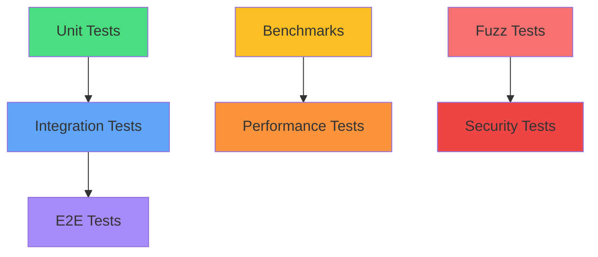

# Paquetes, Módulos y Testing en Go

## Arquitectura y Calidad desde los Cimientos

<div class="pt-12">
  <span @click="$slidev.nav.next" class="px-2 py-1 rounded cursor-pointer" hover:bg="white op-10">
    Presiona Espacio para continuar <carbon:arrow-right class="inline"/>
  </span>
</div>

<div class="abs-br m-6 flex gap-2">
  <a href="https://go.dev/doc/modules" target="_blank" alt="Go Modules Docs" title="Go Modules Docs"
    class="text-xl slidev-icon-btn opacity-50 !border-none !hover:text-white">
    <carbon:document />
  </a>
  <a href="https://github.com/golang/go" target="_blank" alt="GitHub" title="Go en GitHub"
    class="text-xl slidev-icon-btn opacity-50 !border-none !hover:text-white">
    <carbon:logo-github />
  </a>
</div>

---
transition: fade-out
layout: two-cols
---

# Agenda

<v-clicks>

- 📦 **Paquetes en Go**
- 🔧 **Go Modules**
- 🏗️ **Estructura de Proyectos**
- 🧪 **Testing Unitario**
- 📊 **Benchmarking**
- 🎯 **Proyecto: Algoritmo de Luhn**

</v-clicks>

::right::

<div class="ml-4 mt-10">

```go
// Go organiza el código en 
// unidades reutilizables
package validator

import "testing"

func ValidateCard(number string) bool {
    // Implementación
    return true
}
```

</div>

---
layout: center
class: text-center
---

# Parte 1: Paquetes en Go

<div class="text-xl opacity-90 mb-4">
La unidad fundamental de organización
</div>

---

# ¿Qué es un Paquete en Go?

<div class="grid grid-cols-2 gap-8">

<div>

## Definición

<v-clicks>

- **Colección de archivos `.go`** en un directorio
- **Compilados juntos** como unidad
- **Un directorio = Un paquete**
- Declaran `package nombre` al inicio

</v-clicks>

<v-click>

```go
// math.go
package math

func Add(a, b int) int {
    return a + b
}
```

</v-click>

</div>

<div>

## Principio Fundamental

<v-click>

<div class="p-4 bg-blue-500 bg-opacity-10 rounded">

> "Todos los archivos `.go` en un directorio deben pertenecer al mismo paquete"

</div>

</v-click>

<v-click>

```text
calculator/
├── add.go      → package calculator
├── subtract.go → package calculator
└── multiply.go → package calculator
```

</v-click>

<v-click>

❌ **No permitido:** Mezclar paquetes en un directorio

</v-click>

</div>

</div>

---

# Visibilidad: La Regla de Capitalización

Go usa una regla simple y elegante para controlar la visibilidad:

````md magic-move {lines: true}
```go
package greeting

// Hello es EXPORTADO (público) - Primera letra mayúscula
func Hello(name string) string {
    return "Hello, " + name
}

// welcome es NO EXPORTADO (privado) - Primera letra minúscula
func welcome(name string) string {
    return "Welcome, " + name
}
```

```go
package user

// User es un tipo EXPORTADO
type User struct {
    Name  string // Campo EXPORTADO
    email string // Campo NO EXPORTADO
}

// NewUser es EXPORTADO
func NewUser(name, email string) *User {
    return &User{
        Name:  name,
        email: email, // Solo accesible dentro del paquete
    }
}
```

```go
// Desde otro paquete
import "myapp/user"

func main() {
    u := user.NewUser("Alice", "alice@example.com")
    
    fmt.Println(u.Name)  // ✅ Funciona
    fmt.Println(u.email) // ❌ Error de compilación
}
```
````

---

# El Paquete `main`

El paquete `main` tiene un propósito especial en Go:

<div class="grid grid-cols-2 gap-6">

<div>

## Características

<v-clicks>

- **Punto de entrada** de programas ejecutables
- Debe contener función `func main()`
- Se compila a binario ejecutable
- No puede ser importado

</v-clicks>

<v-click>

```go
// cmd/app/main.go
package main

import (
    "fmt"
    "myapp/validator"
)

func main() {
    // Aquí inicia la ejecución
    if validator.IsValid("1234") {
        fmt.Println("Válido!")
    }
}
```

</v-click>

</div>

<div>

## Mejores Prácticas

<v-clicks>

- Mantén `main` **mínimo y simple**
- Delega lógica a otros paquetes
- Solo configuración y arranque
- Facilita el testing

</v-clicks>

<v-click>

```go
// ❌ Evitar: Lógica en main
func main() {
    // 200 líneas de lógica...
}

// ✅ Preferir: main delgado
func main() {
    app := NewApp()
    app.Run()
}
```

</v-click>

</div>

</div>

---
layout: center
class: text-center
---

# Parte 2: Go Modules

<div class="text-xl opacity-90 mb-4">
Sistema moderno de gestión de dependencias
</div>

---

# Evolución: De GOPATH a Go Modules

<div class="timeline">

<v-clicks>

## Era GOPATH (< Go 1.11)

- Todo el código en `$GOPATH/src`
- Sin versionado nativo
- "Dependency Hell"
- Vendoring manual

## Era Modules (Go 1.11+)

- Proyectos en cualquier lugar
- Versionado semántico
- Dependencias declarativas
- Checksums de seguridad

</v-clicks>

</div>

<v-click>

<div class="mt-8 grid grid-cols-2 gap-4">

```bash
# Antes (GOPATH)
$GOPATH/
└── src/
    ├── github.com/user/project
    └── golang.org/x/tools
```

```bash
# Ahora (Modules)
~/proyectos/mi-app/
├── go.mod
├── go.sum
└── main.go
```

</div>

</v-click>

---

# Anatomía de un Módulo

<div class="grid grid-cols-2 gap-6">

<div>

## `go.mod`

<span v-mark.highlight.yellow>Manifiesto del módulo</span>

```go
module github.com/user/luhn-validator

go 1.21

require (
    github.com/stretchr/testify v1.8.4
    golang.org/x/exp v0.0.0-20231006140011
)

require (
    github.com/davecgh/go-spew v1.1.1 // indirect
    github.com/pmezard/go-difflib v1.0.0 // indirect
)
```

<v-clicks>

- **module**: Identificador único global
- **go**: Versión mínima de Go
- **require**: Dependencias directas e indirectas

</v-clicks>

</div>

<div>

## `go.sum`

<span v-mark.highlight.green="2">Checksums criptográficos</span>

```text
github.com/davecgh/go-spew v1.1.1 h1:vj9j/u1bqnvCEfJOwUhtlOARqs3+rkHYY13jYWTU97c=
github.com/davecgh/go-spew v1.1.1/go.mod h1:J7Y8YcW2NihsgmVo/mv3lAwl/skON4iLHjSsI+c5H38=
github.com/stretchr/testify v1.8.4 h1:CcVxjf3Q8PM0mHUKJCdn+eZZtm5yQwehR5yeSVQQcUk=
github.com/stretchr/testify v1.8.4/go.mod h1:sz/lmYIOXD/1dqDmKjjqLyZ2RngseejIcXlSw2iwfAo=
```

<v-clicks>

- Garantiza **integridad**
- Builds **reproducibles**
- Protección contra **tampering**

</v-clicks>

</div>

</div>

---

# Comandos Esenciales de Go Modules

<div class="grid grid-cols-2 gap-4">

<div>

## Inicialización y Gestión

```bash
# Crear nuevo módulo
go mod init github.com/user/project

# Agregar dependencia
go get github.com/pkg/errors

# Actualizar dependencia
go get -u github.com/pkg/errors

# Actualizar a versión específica
go get github.com/pkg/errors@v0.9.1

# Limpiar dependencias no usadas
go mod tidy

# Descargar dependencias
go mod download
```

</div>

<div>

## Verificación y Vendor

```bash
# Verificar integridad
go mod verify

# Crear directorio vendor/
go mod vendor

# Ver gráfico de dependencias
go mod graph

# Explicar por qué se necesita un paquete
go mod why github.com/pkg/errors
```

<v-click>

<div class="mt-4 p-3 bg-green-500 bg-opacity-10 rounded">

💡 **Tip:** Siempre ejecuta `go mod tidy` antes de hacer commit

</div>

</v-click>

</div>

</div>

---

# Versionado Semántico en Go

Go usa **Semantic Versioning** con una regla especial:

<div class="mt-6">

## Formato: `vMAJOR.MINOR.PATCH`

<v-clicks>

- **PATCH** (v1.0.1): Corrección de bugs
- **MINOR** (v1.1.0): Nueva funcionalidad compatible
- **MAJOR** (v2.0.0): Cambios incompatibles

</v-clicks>

</div>

<v-click>

## Regla de Importación Semántica

<span v-mark.circle.red="2">Para v2+, el número de versión es parte del path</span>

</v-click>

<v-click>

```go
// Para v1.x.x
import "github.com/user/library"

// Para v2.x.x - ¡Nota el /v2!
import "github.com/user/library/v2"

// Para v3.x.x
import "github.com/user/library/v3"
```

</v-click>

<v-click>

<div class="mt-4 p-4 bg-yellow-500 bg-opacity-10 rounded">

⚠️ **Importante:** Esto permite usar múltiples versiones mayores en el mismo proyecto

</div>

</v-click>

---
layout: center
class: text-center
---

# Parte 3: Estructura de Proyectos

<div class="text-xl opacity-90 mb-4">
Patrones y convenciones de la comunidad
</div>

---

# Layout Canónico de Proyectos Go

<div class="grid grid-cols-2 gap-6">

<div>

```text {all|3-5|7-9|11-13|15-17|all}
myproject/
│
├── cmd/                 # Puntos de entrada
│   └── app/
│       └── main.go
│
├── internal/           # Código privado
│   ├── handler/
│   └── validator/
│
├── pkg/               # Código público reutilizable
│   └── luhn/
│
├── test/              # Tests adicionales
│   └── integration/
│
├── go.mod
├── go.sum
└── README.md
```

</div>

<div>

## Directorios Clave

<v-clicks>

### `/cmd`
- Aplicaciones ejecutables
- Un subdirectorio por binario
- Solo `package main`

### `/internal`
- **Código privado del módulo**
- Go prohibe importarlo desde fuera
- Encapsulación garantizada

### `/pkg`
- APIs públicas reutilizables
- Puede ser importado por otros
- Opcional y debatido

</v-clicks>

</div>

</div>

---

# El Directorio `internal`

<span v-mark.underline.orange>Mecanismo de encapsulación único de Go</span>

<div class="grid grid-cols-2 gap-4 mt-4">

```go
// myapp/internal/auth/token.go
package auth

func GenerateToken() string {
    return "secret-token"
}
```

<div>

```go
// ✅ Permitido: mismo módulo
// myapp/cmd/server/main.go
import "myapp/internal/auth"

func main() {
    token := auth.GenerateToken()
}
```

```go
// ❌ Prohibido: módulo externo
// otherapp/main.go
import "github.com/user/myapp/internal/auth"
// Error de compilación!
```

</div>

</div>

<v-click>

<div class="mt-6 p-4 bg-blue-500 bg-opacity-10 rounded">

## Ventajas del directorio `internal`

- 🔒 **Encapsulación forzada** por el compilador
- 🔄 **Libertad para refactorizar** sin romper usuarios externos
- 📚 **API pública clara** - solo lo que no está en `internal`

</div>

</v-click>

---

# Ejemplo: Estructura para una Aplicación Web

```text {all|2-6|8-19|21-24|all}
taskmaster/
├── cmd/
│   ├── api/            # API REST principal
│   │   └── main.go
│   └── migrate/        # Herramienta de migraciones
│       └── main.go
│
├── internal/
│   ├── handler/        # HTTP handlers
│   │   ├── task.go
│   │   └── user.go
│   ├── service/        # Lógica de negocio
│   │   ├── task.go
│   │   └── user.go
│   └── repository/     # Acceso a datos
│       ├── postgres/
│       │   └── task.go
│       └── interface.go
│
├── pkg/
│   ├── validator/      # Validaciones reutilizables
│   └── middleware/     # Middleware HTTP genérico
│
├── migrations/         # Scripts SQL
├── docker-compose.yml
└── Makefile
```

---
layout: center
class: text-center
---

# Parte 4: Testing en Go

<div class="text-xl opacity-90 mb-4">
Calidad integrada en el lenguaje
</div>

---

# Filosofía del Testing en Go

<div class="text-center mb-8">

> "El testing no es opcional, es fundamental"

</div>

<div class="grid grid-cols-3 gap-4">

<div class="border border-gray-400 rounded p-4">

<div class="text-2xl mb-2">🛠️</div>

### Integrado

<v-clicks depth="2">

- `go test` incluido
- Sin frameworks externos
- Package `testing` estándar

</v-clicks>

</div>

<div class="border border-gray-400 rounded p-4">

<div class="text-2xl mb-2">📝</div>

### Simple

<v-clicks depth="2">

- Convenciones claras
- `*_test.go`
- `TestXxx(t *testing.T)`

</v-clicks>

</div>

<div class="border border-gray-400 rounded p-4">

<div class="text-2xl mb-2">⚡</div>

### Rápido

<v-clicks depth="2">

- Ejecución paralela
- Cache de resultados
- Mínimo overhead

</v-clicks>

</div>

</div>

---

# Convenciones de Testing

<div class="grid grid-cols-2 gap-8">

<div>

## Archivos de Test

```go
// calculator.go
package calculator

func Add(a, b int) int {
    return a + b
}
```

```go
// calculator_test.go
package calculator

import "testing"

func TestAdd(t *testing.T) {
    result := Add(2, 3)
    if result != 5 {
        t.Errorf("Add(2,3) = %d; want 5", result)
    }
}
```

</div>

<div>

## Reglas Básicas

<v-clicks>

- Archivos terminan en `_test.go`
- Mismo directorio que el código
- Funciones comienzan con `Test`
- Reciben `*testing.T`
- Sin valor de retorno

</v-clicks>

<v-click>

## Ejecutar Tests

```bash
# Todos los tests
go test

# Con detalles
go test -v

# Un test específico
go test -run TestAdd

# Con cobertura
go test -cover
```

</v-click>

</div>

</div>

---

# El Tipo `testing.T`

Tu interfaz con el framework de testing:

````md magic-move {lines: true}
```go
func TestExample(t *testing.T) {
    // Reportar error (continúa ejecutando)
    t.Error("Algo salió mal")
    t.Errorf("Esperaba %d, obtuve %d", 5, 3)
    
    // Log información (solo se muestra si falla)
    t.Log("Información de debug")
    t.Logf("Valor: %v", someValue)
}
```

```go
func TestCritical(t *testing.T) {
    // Error fatal (detiene el test)
    file, err := os.Open("config.json")
    if err != nil {
        t.Fatal("No se pudo abrir config:", err)
    }
    defer file.Close()
    
    // El código siguiente solo ejecuta si no hubo Fatal
    processFile(file)
}
```

```go
func TestWithHelpers(t *testing.T) {
    // Marcar función como helper
    t.Helper() // Los errores apuntan al caller
    
    // Saltar test condicionalmente
    if runtime.GOOS == "windows" {
        t.Skip("No soportado en Windows")
    }
    
    // Registrar limpieza
    t.Cleanup(func() {
        // Se ejecuta al final del test
        os.Remove("temp.txt")
    })
}
```
````

---

# Tests Table-Driven

<span v-mark.underline.green>El patrón idiomático de Go</span>

```go {all|2-7|9-17|19-27|all}
func TestLuhnValidate(t *testing.T) {
    tests := []struct {
        name     string
        input    string
        expected bool
    }{
        {"valid visa", "4532015112830366", true},
        {"valid mastercard", "5425233430109903", true},
        {"invalid number", "1234567890123456", false},
        {"empty string", "", false},
        {"with spaces", "4532 0151 1283 0366", true},
        {"with dashes", "4532-0151-1283-0366", true},
        {"single digit", "5", false},
        {"invalid characters", "4532a15112830366", false},
    }
    
    for _, tt := range tests {
        t.Run(tt.name, func(t *testing.T) {
            result := Validate(tt.input)
            if result != tt.expected {
                t.Errorf("Validate(%q) = %v, want %v", 
                        tt.input, result, tt.expected)
            }
        })
    }
}
```

---

# Subtests con `t.Run`

Organización jerárquica y ejecución selectiva:

<div class="grid grid-cols-2 gap-4">

```go
func TestCreditCard(t *testing.T) {
    t.Run("Validation", func(t *testing.T) {
        t.Run("Visa", func(t *testing.T) {
            // Test Visa
        })
        t.Run("MasterCard", func(t *testing.T) {
            // Test MasterCard
        })
    })
    
    t.Run("Formatting", func(t *testing.T) {
        t.Run("AddSpaces", func(t *testing.T) {
            // Test espaciado
        })
        t.Run("RemoveSpaces", func(t *testing.T) {
            // Test limpieza
        })
    })
}
```

<div>

## Output Estructurado

```bash
$ go test -v
=== RUN   TestCreditCard
=== RUN   TestCreditCard/Validation
=== RUN   TestCreditCard/Validation/Visa
=== RUN   TestCreditCard/Validation/MasterCard
=== RUN   TestCreditCard/Formatting
=== RUN   TestCreditCard/Formatting/AddSpaces
--- PASS: TestCreditCard (0.00s)
    --- PASS: TestCreditCard/Validation (0.00s)
        --- PASS: .../Visa (0.00s)
        --- PASS: .../MasterCard (0.00s)
    --- PASS: TestCreditCard/Formatting (0.00s)
```

## Ejecutar Específico

```bash
go test -run TestCreditCard/Validation/Visa
```

</div>

</div>

---
layout: center
---

# Benchmarking en Go

<div class="text-xl opacity-90">
Mide el rendimiento, no adivines
</div>

---

# Escribiendo Benchmarks

Los benchmarks siguen convenciones similares a los tests:

````md magic-move {lines: true}
```go
// Benchmark básico
func BenchmarkLuhnValidate(b *testing.B) {
    for i := 0; i < b.N; i++ {
        Validate("4532015112830366")
    }
}
```

```go
// Benchmark con setup
func BenchmarkLuhnValidate(b *testing.B) {
    // Setup no medido
    testCard := "4532015112830366"
    
    b.ResetTimer() // Inicia medición aquí
    
    for i := 0; i < b.N; i++ {
        Validate(testCard)
    }
}
```

```go
// Benchmark table-driven
func BenchmarkLuhnValidate(b *testing.B) {
    sizes := []struct {
        name string
        card string
    }{
        {"16digits", "4532015112830366"},
        {"19digits", "6011000990139424543"},
        {"withSpaces", "4532 0151 1283 0366"},
    }
    
    for _, size := range sizes {
        b.Run(size.name, func(b *testing.B) {
            for i := 0; i < b.N; i++ {
                Validate(size.card)
            }
        })
    }
}
```
````

---

# Interpretando Resultados de Benchmarks

<div class="grid grid-cols-2 gap-4">

<div>

## Ejecutar Benchmarks

```bash
# Todos los benchmarks
go test -bench=.

# Benchmark específico
go test -bench=BenchmarkLuhn

# Con estadísticas de memoria
go test -bench=. -benchmem

# Múltiples iteraciones
go test -bench=. -count=5

# Tiempo mínimo
go test -bench=. -benchtime=10s
```

</div>

<div>

## Leer Resultados

```text
BenchmarkLuhnValidate-8
    1000000    1052 ns/op    248 B/op    5 allocs/op
```

<v-clicks>

- `BenchmarkLuhnValidate-8`: Nombre y CPUs
- `1000000`: Iteraciones ejecutadas
- `1052 ns/op`: Nanosegundos por operación
- `248 B/op`: Bytes allocados por op
- `5 allocs/op`: Allocaciones por op

</v-clicks>

<v-click>

## Comparar con benchstat

```bash
go install golang.org/x/perf/cmd/benchstat@latest
benchstat old.txt new.txt
```

</v-click>

</div>

</div>

---

# Cobertura de Código

<div class="grid grid-cols-2 gap-6">

<div>

## Generar Cobertura

```bash
# Ver porcentaje
go test -cover

# Generar archivo de cobertura
go test -coverprofile=coverage.out

# Por paquete
go test -cover ./...

# Modo de conteo
go test -covermode=count
```

<v-click>

## Visualizar

```bash
# HTML interactivo
go tool cover -html=coverage.out

# En terminal
go tool cover -func=coverage.out
```

</v-click>

</div>

<div>

## Ejemplo de Output

```text
PASS
coverage: 78.5% of statements
ok  github.com/user/luhn  0.003s
```

<v-click>

## Por Función

```text
github.com/user/luhn/luhn.go:8:    Validate     85.7%
github.com/user/luhn/luhn.go:24:   checkSum     100.0%
github.com/user/luhn/luhn.go:35:   isValid      100.0%
github.com/user/luhn/format.go:5:  Format       62.5%
total:                              (statements) 78.5%
```

</v-click>

<v-click>

<div class="mt-4 p-3 bg-green-500 bg-opacity-10 rounded">

💡 **Meta:** Apunta a >80% de cobertura

</div>

</v-click>

</div>

</div>

---

# Técnicas Avanzadas: Fuzzing

<span v-mark.highlight.yellow>Testing con entradas aleatorias (Go 1.18+)</span>

<div class="grid grid-cols-2 gap-4">

```go
func FuzzLuhnValidate(f *testing.F) {
    // Casos semilla
    testcases := []string{
        "4532015112830366",
        "5425233430109903",
        "371449635398431",
        "",
        "invalid",
    }
    
    for _, tc := range testcases {
        f.Add(tc)
    }
    
    // Función de fuzzing
    f.Fuzz(func(t *testing.T, input string) {
        // No debe entrar en pánico
        result := Validate(input)
        
        // Propiedad: resultado consistente
        result2 := Validate(input)
        if result != result2 {
            t.Error("Resultados inconsistentes")
        }
    })
}
```

<div>

## ¿Qué es Fuzzing?

<v-clicks>

- Genera entradas aleatorias
- Busca panics y bugs
- Encuentra edge cases
- Guarda casos problemáticos

</v-clicks>

<v-click>

## Ejecutar Fuzzing

```bash
# Ejecutar fuzzing
go test -fuzz=FuzzLuhn

# Con límite de tiempo
go test -fuzz=FuzzLuhn -fuzztime=30s

# Ver corpus generado
ls testdata/fuzz/FuzzLuhnValidate/
```

</v-click>

<v-click>

<div class="mt-4 p-3 bg-yellow-500 bg-opacity-10 rounded">

🔍 Fuzzing es excelente para encontrar casos no previstos

</div>

</v-click>

</div>

</div>

---
layout: center
class: text-center
---

# Proyecto Práctico

## Implementación del Algoritmo de Luhn

<div class="mt-8 text-lg opacity-90">
Validación de tarjetas de crédito con testing completo
</div>

---

# El Algoritmo de Luhn

Algoritmo de checksum usado para validar números de tarjetas de crédito:

<div class="grid grid-cols-2 gap-6 mt-6">

<div>

## Pasos del Algoritmo

<v-clicks>

1. **Duplicar** dígitos alternos (desde la derecha)
2. Si resultado > 9, **restar 9**
3. **Sumar** todos los dígitos
4. Válido si suma es **múltiplo de 10**

</v-clicks>

<v-click>

## Ejemplo: `4532015112830366`

```text
4 5 3 2 0 1 5 1 1 2 8 3 0 3 6 6
↓ ↓ ↓ ↓ ↓ ↓ ↓ ↓ ↓ ↓ ↓ ↓ ↓ ↓ ↓ ↓
4 10 3 4 0 2 5 2 1 4 8 6 0 6 6 12
↓ ↓ ↓ ↓ ↓ ↓ ↓ ↓ ↓ ↓ ↓ ↓ ↓ ↓ ↓ ↓
4 1 3 4 0 2 5 2 1 4 8 6 0 6 6 3
                              = 50 ✓
```

</v-click>

</div>

<div>

## Casos de Uso

<v-clicks>

- Validación de tarjetas de crédito
- Detección de errores de tipeo
- Verificación de IMEI (móviles)
- Números de cuenta bancaria

</v-clicks>

<v-click>

## Estructura del Proyecto

```text
luhn-validator/
├── go.mod
├── go.sum
├── luhn.go
├── luhn_test.go
├── benchmark_test.go
├── example_test.go
└── README.md
```

</v-click>

</div>

</div>

---

# Implementación: luhn.go

```go {all|1-7|9-18|20-35|all} {maxHeight:'400px'}
// Package luhn implements the Luhn algorithm for validation
package luhn

import (
    "strings"
    "unicode"
)

// Validate checks if a string passes the Luhn algorithm
func Validate(number string) bool {
    // Clean the input: remove spaces and dashes
    cleaned := strings.ReplaceAll(number, " ", "")
    cleaned = strings.ReplaceAll(cleaned, "-", "")
    
    // Check minimum length and all digits
    if len(cleaned) <= 1 {
        return false
    }
    
    for _, r := range cleaned {
        if !unicode.IsDigit(r) {
            return false
        }
    }
    
    return checksum(cleaned)
}

// checksum performs the Luhn algorithm
func checksum(number string) bool {
    sum := 0
    double := false
    
    // Process from right to left
    for i := len(number) - 1; i >= 0; i-- {
        digit := int(number[i] - '0')
        
        if double {
            digit *= 2
            if digit > 9 {
                digit -= 9
            }
        }
        
        sum += digit
        double = !double
    }
    
    return sum%10 == 0
}
```

---

# Tests Unitarios: luhn_test.go

```go {all|1-7|9-28|30-38|all} {maxHeight:'400px'}
package luhn

import (
    "testing"
)

func TestValidate(t *testing.T) {
    tests := []struct {
        name     string
        number   string
        expected bool
    }{
        // Casos válidos
        {"valid Visa", "4532015112830366", true},
        {"valid MasterCard", "5425233430109903", true},
        {"valid Amex", "371449635398431", true},
        {"with spaces", "4532 0151 1283 0366", true},
        {"with dashes", "4532-0151-1283-0366", true},
        
        // Casos inválidos
        {"invalid checksum", "4532015112830367", false},
        {"single digit", "5", false},
        {"empty string", "", false},
        {"only spaces", "   ", false},
        {"letters", "4532a15112830366", false},
        {"special chars", "4532@151#1283$366", false},
    }
    
    for _, tt := range tests {
        t.Run(tt.name, func(t *testing.T) {
            result := Validate(tt.number)
            if result != tt.expected {
                t.Errorf("Validate(%q) = %v, want %v",
                        tt.number, result, tt.expected)
            }
        })
    }
}

func TestChecksum(t *testing.T) {
    // Test de la función interna
    testCases := []struct {
        number   string
        expected bool
    }{
        {"4532015112830366", true},
        {"5425233430109903", true},
        {"371449635398431", true},
        {"1234567890123456", false},
    }
    
    for _, tc := range testCases {
        result := checksum(tc.number)
        if result != tc.expected {
            t.Errorf("checksum(%q) = %v, want %v",
                    tc.number, result, tc.expected)
        }
    }
}
```

---

# Benchmarks: benchmark_test.go

```go {all|1-9|11-24|26-42|all}
package luhn

import (
    "testing"
)

func BenchmarkValidate(b *testing.B) {
    for i := 0; i < b.N; i++ {
        Validate("4532015112830366")
    }
}

func BenchmarkValidateWithSpaces(b *testing.B) {
    for i := 0; i < b.N; i++ {
        Validate("4532 0151 1283 0366")
    }
}

func BenchmarkValidateInvalid(b *testing.B) {
    for i := 0; i < b.N; i++ {
        Validate("1234567890123456")
    }
}

func BenchmarkValidateSizes(b *testing.B) {
    sizes := []struct {
        name   string
        number string
    }{
        {"15digits", "371449635398431"},
        {"16digits", "4532015112830366"},
        {"19digits", "6011000990139424543"},
        {"withSpaces", "4532 0151 1283 0366"},
        {"withDashes", "4532-0151-1283-0366"},
    }
    
    for _, size := range sizes {
        b.Run(size.name, func(b *testing.B) {
            for i := 0; i < b.N; i++ {
                Validate(size.number)
            }
        })
    }
}
```

---

# Tests de Ejemplo: example_test.go

```go
package luhn_test

import (
    "fmt"
    "github.com/user/luhn-validator"
)

func ExampleValidate() {
    // Validar una tarjeta Visa
    valid := luhn.Validate("4532015112830366")
    fmt.Println(valid)
    // Output: true
}

func ExampleValidate_withSpaces() {
    // Los espacios son ignorados
    valid := luhn.Validate("4532 0151 1283 0366")
    fmt.Println(valid)
    // Output: true
}

func ExampleValidate_invalid() {
    // Número inválido
    valid := luhn.Validate("1234567890123456")
    fmt.Println(valid)
    // Output: false
}
```

<v-click>

<div class="mt-4 p-4 bg-blue-500 bg-opacity-10 rounded">

💡 **Los tests de ejemplo** aparecen en la documentación y se ejecutan como tests

</div>

</v-click>

---

# Fuzzing Test

```go
func FuzzValidate(f *testing.F) {
    // Agregar casos semilla
    testcases := []string{
        "4532015112830366",
        "5425233430109903",
        "371449635398431",
        "",
        "invalid",
        "1234567890123456",
        "4532 0151 1283 0366",
    }
    
    for _, tc := range testcases {
        f.Add(tc)
    }
    
    f.Fuzz(func(t *testing.T, input string) {
        // No debe entrar en pánico
        result := Validate(input)
        
        // Verificar consistencia
        result2 := Validate(input)
        if result != result2 {
            t.Errorf("Resultados inconsistentes para %q", input)
        }
        
        // Si es válido, verificar propiedades
        if result {
            // Debe tener al menos 2 dígitos
            digitCount := 0
            for _, r := range input {
                if r >= '0' && r <= '9' {
                    digitCount++
                }
            }
            if digitCount <= 1 {
                t.Errorf("Validó con %d dígitos: %q", digitCount, input)
            }
        }
    })
}
```

---

# README.md del Proyecto

```markdown {all|1-10|12-24|26-35|37-51|all} {maxHeight:'400px'}
# Luhn Validator

Implementación del algoritmo de Luhn en Go para validación de tarjetas de crédito.

## Instalación

```bash
go get github.com/user/luhn-validator
```

## Uso

```go
package main

import (
    "fmt"
    "github.com/user/luhn-validator"
)

func main() {
    if luhn.Validate("4532015112830366") {
        fmt.Println("Tarjeta válida")
    }
}
```

## Ejecutar Tests

```bash
# Tests unitarios
go test

# Con cobertura
go test -cover

# Ver detalles
go test -v
```

## Ejecutar Benchmarks

```bash
# Todos los benchmarks
go test -bench=.

# Con información de memoria
go test -bench=. -benchmem

# Guardar resultados
go test -bench=. > bench.txt
```

## Ejecutar Fuzzing

```bash
# Fuzzing por 30 segundos
go test -fuzz=FuzzValidate -fuzztime=30s
```

## Estructura del Proyecto

```
.
├── go.mod          # Definición del módulo
├── luhn.go         # Implementación principal
├── luhn_test.go    # Tests unitarios
├── benchmark_test.go # Benchmarks
├── example_test.go # Ejemplos ejecutables
└── README.md       # Documentación
```

## Algoritmo

El algoritmo de Luhn es un checksum simple usado para validar números de identificación:

1. Desde la derecha, duplicar cada segundo dígito
2. Si el resultado > 9, restar 9
3. Sumar todos los dígitos
4. El número es válido si la suma es múltiplo de 10

## Licencia

MIT
```

---

# Makefile para el Proyecto

```makefile
.PHONY: test bench coverage clean help

# Default target
all: test

# Ejecutar tests
test:
	@echo "🧪 Ejecutando tests..."
	@go test -v -race ./...

# Ejecutar benchmarks
bench:
	@echo "📊 Ejecutando benchmarks..."
	@go test -bench=. -benchmem

# Generar cobertura
coverage:
	@echo "📈 Generando reporte de cobertura..."
	@go test -coverprofile=coverage.out
	@go tool cover -html=coverage.out -o coverage.html
	@echo "✅ Reporte generado: coverage.html"

# Fuzzing
fuzz:
	@echo "🎲 Ejecutando fuzzing por 30s..."
	@go test -fuzz=FuzzValidate -fuzztime=30s

# Limpiar archivos generados
clean:
	@echo "🧹 Limpiando..."
	@rm -f coverage.out coverage.html
	@rm -rf testdata/fuzz

# Verificar formato
fmt:
	@echo "🎨 Verificando formato..."
	@gofmt -l -w .

# Análisis estático
vet:
	@echo "🔍 Ejecutando go vet..."
	@go vet ./...

# CI: todo lo necesario para CI/CD
ci: fmt vet test coverage

# Ayuda
help:
	@echo "Comandos disponibles:"
	@echo "  make test     - Ejecutar tests"
	@echo "  make bench    - Ejecutar benchmarks"
	@echo "  make coverage - Generar cobertura"
	@echo "  make fuzz     - Ejecutar fuzzing"
	@echo "  make clean    - Limpiar archivos"
	@echo "  make fmt      - Formatear código"
	@echo "  make vet      - Análisis estático"
	@echo "  make ci       - Pipeline CI completo"
```

---

# GitHub Actions CI/CD

```yaml
name: CI

on:
  push:
    branches: [ main ]
  pull_request:
    branches: [ main ]

jobs:
  test:
    name: Test
    runs-on: ubuntu-latest
    
    strategy:
      matrix:
        go-version: [1.20, 1.21]
    
    steps:
    - uses: actions/checkout@v3
    
    - name: Setup Go
      uses: actions/setup-go@v4
      with:
        go-version: ${{ matrix.go-version }}
    
    - name: Cache Go modules
      uses: actions/cache@v3
      with:
        path: ~/go/pkg/mod
        key: ${{ runner.os }}-go-${{ hashFiles('**/go.sum') }}
    
    - name: Download dependencies
      run: go mod download
    
    - name: Format check
      run: |
        if [ "$(gofmt -s -l . | wc -l)" -gt 0 ]; then
          echo "Please run 'go fmt ./...'"
          exit 1
        fi
    
    - name: Vet
      run: go vet ./...
    
    - name: Test
      run: go test -v -race -coverprofile=coverage.out ./...
    
    - name: Coverage
      uses: codecov/codecov-action@v3
      with:
        file: ./coverage.out
    
    - name: Benchmark
      run: go test -bench=. -benchmem
```

---
layout: center
class: text-center
---

# Mejores Prácticas

---

# Principios del Testing Efectivo

<div class="grid grid-cols-2 gap-8">

<div>

## ✅ DO

<v-clicks>

- **Test comportamiento, no implementación**
- **Nombres descriptivos** para tests
- **Table-driven tests** para múltiples casos
- **Subtests** para organización
- **Benchmarks** para código crítico
- **Fuzzing** para encontrar edge cases
- **CI/CD** automatizado

</v-clicks>

</div>

<div>

## ❌ DON'T

<v-clicks>

- **No ignores** tests que fallan
- **Evita sleeps** - usa sincronización
- **No compartas estado** entre tests
- **No olvides** casos límite
- **No hardcodees** valores esperados
- **No te saltes** `go mod tidy`
- **No ignores** warnings del linter

</v-clicks>

</div>

</div>

---

# Estructura de Testing por Capas

<div class="text-center mb-6">



</div>

<div class="grid grid-cols-3 gap-4 text-sm">

<div>

### Base: Unit Tests
- Rápidos y aislados
- Mayor cantidad
- Mock de dependencias

</div>

<div>

### Medio: Integration
- Componentes reales
- Base de datos test
- Menos cantidad

</div>

<div>

### Top: E2E
- Sistema completo
- Menor cantidad
- Más lentos

</div>

</div>

---
layout: center
class: text-center
---

# Resumen

<div class="grid grid-cols-4 gap-4 mt-8">
  <div class="border border-green-400 rounded p-4">
    <div class="text-3xl mb-2">📦</div>
    <div class="font-bold">Paquetes</div>
    <div class="text-sm opacity-75">Organización clara</div>
  </div>
  <div class="border border-blue-400 rounded p-4">
    <div class="text-3xl mb-2">🔧</div>
    <div class="font-bold">Módulos</div>
    <div class="text-sm opacity-75">Gestión moderna</div>
  </div>
  <div class="border border-purple-400 rounded p-4">
    <div class="text-3xl mb-2">🏗️</div>
    <div class="font-bold">Estructura</div>
    <div class="text-sm opacity-75">Patrones probados</div>
  </div>
  <div class="border border-orange-400 rounded p-4">
    <div class="text-3xl mb-2">🧪</div>
    <div class="font-bold">Testing</div>
    <div class="text-sm opacity-75">Calidad integrada</div>
  </div>
</div>

<v-click>

<div class="mt-8 text-2xl">

**Go hace que escribir buen código y tests sea el camino fácil**

</div>

</v-click>

---
layout: center
class: text-center
---

# ¡Gracias!

## ¿Preguntas?

<div class="mt-8">

📚 **Recursos Recomendados:**

- [Go Modules Reference](https://go.dev/ref/mod)
- [Effective Go](https://go.dev/doc/effective_go)
- [Learn Go with Tests](https://quii.gitbook.io/learn-go-with-tests)
- [Go Project Layout](https://github.com/golang-standards/project-layout)

</div>

<div class="mt-6">

🔗 **Código del proyecto:**

```bash
git clone https://github.com/user/luhn-validator
cd luhn-validator
make test
```

</div>

<div class="mt-6 text-sm opacity-75">

Presentación creada con [Slidev](https://sli.dev)

</div>