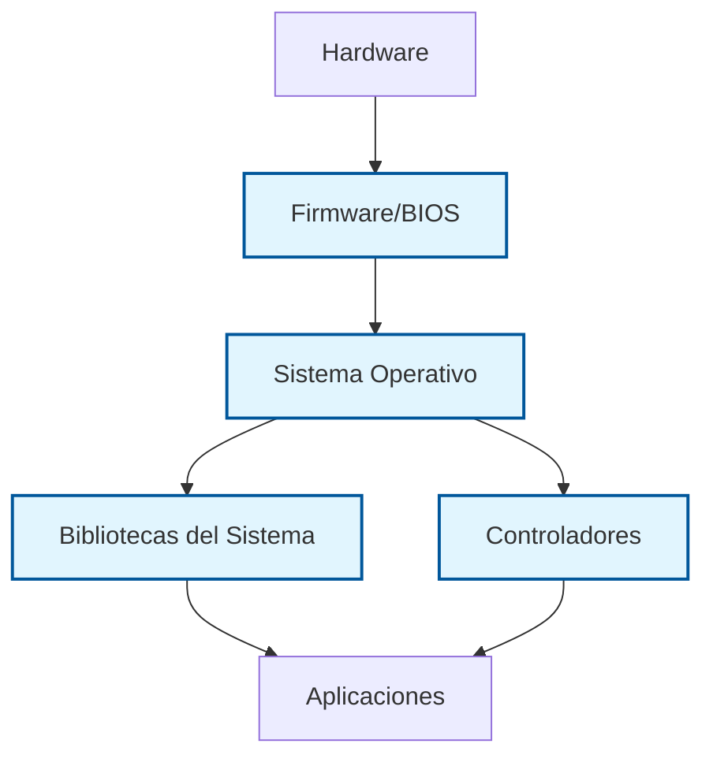
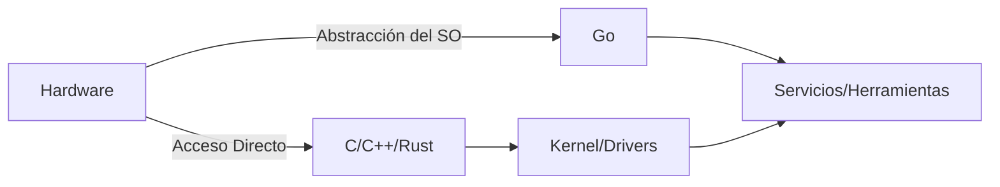

# Programación de Sistemas

## Fundamentos y Enfoques Modernos

<div class="text-2xl mt-8">
Desde Kernels de SO hasta Infraestructura Cloud
</div>

<div @click="$slidev.nav.next" class="mt-12 py-1" hover:bg="white op-10">
  Presiona Espacio para continuar <carbon:arrow-right />
</div>

---
transition: fade-out
---

# ¿Qué es la Programación de Sistemas?

<div class="text-lg">

Desarrollo de <span v-mark.highlight.yellow>software de bajo nivel</span> que proporciona servicios esenciales

</div>

<v-clicks>

- **Software de Sistema vs Software de Aplicación**
  - Sistemas operativos, controladores de dispositivos, compiladores
  - Motores de bases de datos, pilas de red
  - Firmware y sistemas embebidos

- **Características Clave**
  - <span v-mark.underline.red="2">Contextos críticos de rendimiento</span>
  - Interacción directa con hardware
  - Capa de servicio para aplicaciones
  - Sobrecarga mínima en tiempo de ejecución

</v-clicks>

<div v-click="3" class="mt-8 text-sm text-gray-600">
💡 Los programas de sistema son la base que permite todo el software restante
</div>

---
layout: two-cols
---

# Características Fundamentales

<v-clicks>

### Restricciones de Rendimiento

- Cada ciclo de CPU importa
- Optimización de huella de memoria
- Requisitos de tiempo real

### Conciencia del Hardware
- Explotación del caché de CPU
- Optimización del conjunto de instrucciones
- Manipulación directa de memoria

### Rol de Proveedor de Servicios
- APIs y abstracciones
- Gestión de recursos
- Capa de abstracción de hardware

</v-clicks>

::right::

<div v-click="4" class="ml-8 mt-12">

### Ejemplos de Software de Sistema



</div>

---

# El Desafío de la Programación de Sistemas

<div class="grid grid-cols-2 gap-8 mt-8">

<div v-click>

### Complejidad de Depuración

- Soporte limitado de depuradores
- Restricciones del modo kernel
- Necesidad de emuladores de hardware
- Logging como herramienta principal

</div>

<div v-click>

### Modos de Falla Críticos

- Fallos a nivel de sistema
- Vulnerabilidades de seguridad
- Corrupción de datos
- Degradación del rendimiento

</div>

</div>

<div v-click class="mt-12">

### Conocimiento Requerido

- Arquitectura de computadoras
- Internos del sistema operativo
- Concurrencia y sincronización
- Modelos y gestión de memoria

</div>

---
transition: slide-up
level: 2
layout: two-cols
---

# Principios de Sistemas Operativos

<div class="mt-4">

La base teórica de la programación de sistemas proviene del diseño de SO

</div>

<v-clicks>

- **Gestión de Memoria**
  - Memoria virtual y paginación
  - Asignación heap vs stack
  - Estrategias de caché

- **Planificación de CPU**
  - Gestión de procesos e hilos
  - Cambio de contexto
  - Algoritmos de planificación

</v-clicks>

::right::

<v-clicks>

- **Manejo de Interrupciones**
  - Interrupciones de hardware y software
  - Rutinas de Servicio de Interrupción (ISR)
  - Restricciones de tiempo real

</v-clicks>

---
layout: center
---

# Programación de Sistemas Práctica

## Tareas y Desafíos del Mundo Real

---

# Operaciones del Sistema de Archivos

<div class="grid grid-cols-2 gap-6">

<div>

### E/S de Archivos de Bajo Nivel

```c
int fd = open("/ruta/archivo", O_RDWR);
if (fd < 0) {
    handle_error();
}

ssize_t bytes = read(fd, buffer, size);
// Manejar lecturas parciales

write(fd, data, length);
// Asegurar que los datos se escriban

close(fd);
```

</div>

<div v-click>

### Operaciones Avanzadas

- Archivos mapeados en memoria (`mmap`)
- Mecanismos de bloqueo de archivos
- Recorrido de directorios
- Acceso a nivel de bloque
- <span v-mark.underline.red="2">Todo es un archivo</span>
  - Dispositivos
  - Pipes
  - Sockets

</div>

</div>

---

# Programación de Redes

<div class="text-lg">
Construir sistemas en red desde <span v-mark.highlight.yellow>primitivas de sockets</span>
</div>

<div class="grid grid-cols-2 gap-4 mt-6">

<div>

```c
// Creación de socket servidor
int sock = socket(AF_INET, 
                 SOCK_STREAM, 0);
bind(sock, address, sizeof(address));
listen(sock, backlog);

// Aceptar conexiones
while (1) {
    int client = accept(sock, ...);
    handle_client(client);
}
```

</div>

<div v-click>

### Conceptos Clave

- Protocolos TCP vs UDP
- E/S no bloqueante
- Modelos dirigidos por eventos (`epoll`, `kqueue`)
- Implementación de protocolos
- Operaciones a nivel de paquete

<div v-click class="mt-4 text-sm">
📡 Los programadores de sistemas construyen la infraestructura para redes de alto nivel
</div>

</div>

</div>

---

# Controladores de Dispositivos y Control de Hardware

<v-clicks>

### Responsabilidades del Controlador

- Inicialización de hardware
- Manejo de interrupciones
- Configuración y gestión de DMA
- Gestión de energía

### E/S Mapeada en Memoria

```c
// Acceso directo a registros de hardware
volatile uint32_t* device_reg = 
    (uint32_t*)0xDEADBEEF;

// Escribir comando al dispositivo
*device_reg = COMMAND_START;

// Esperar completación
while (*device_reg & STATUS_BUSY) {
    cpu_relax();
}
```

### Control de Dispositivos en Espacio de Usuario

- ioctl() para comandos específicos del dispositivo
- Control de dispositivos USB vía libusb
- Manipulación de GPIO

</v-clicks>

---

# Concurrencia y Sincronización

<div class="text-lg">
Gestionar la <span v-mark.circle.blue>ejecución paralela</span> de forma segura y eficiente
</div>

<div class="grid grid-cols-2 gap-6 mt-6">

<div>

### Primitivas de Sincronización

```c
pthread_mutex_t lock;
pthread_mutex_lock(&lock);

// Sección crítica
shared_data++;

pthread_mutex_unlock(&lock);
```

- Mutex y semáforos
- Variables de condición
- Locks de lectura-escritura
- Operaciones atómicas

</div>

<div v-click>

### Comunicación entre Procesos

- Pipes y pipes con nombre
- Colas de mensajes
- Segmentos de memoria compartida
- Sockets de dominio UNIX
- Señales

<div v-click class="mt-4 text-sm bg-yellow-50 p-2 rounded">
⚠️ Las condiciones de carrera y los deadlocks son la pesadilla de los sistemas concurrentes
</div>

</div>

</div>

---

# Desarrollo de Demonios y Servicios

Construir <span v-mark.highlight.yellow>servicios en segundo plano</span> que se ejecutan continuamente

<v-clicks>

### Características de los Demonios

- Sin terminal de control
- Ejecutarse en segundo plano
- Iniciar en el arranque
- Manejar señales elegantemente

### Patrón de Implementación

```c
// Creación clásica de demonio UNIX
pid_t pid = fork();
if (pid > 0) exit(0);  // El padre termina

// El hijo continúa
setsid();  // Nuevo líder de sesión

// Segundo fork (opcional)
pid = fork();
if (pid > 0) exit(0);

// Comienza el trabajo del demonio
close_all_fds();
open_log_files();
write_pid_file();
signal(SIGTERM, cleanup_handler);
```

</v-clicks>

---
layout: center
---

# Lenguajes de Programación de Sistemas

## C, C++ y Rust

---

# C: La Elección Clásica

<div class="grid grid-cols-2 gap-8">

<div>

### Fortalezas
- Sobrecarga mínima en tiempo de ejecución
- Acceso directo al hardware
- Rendimiento predecible
- Interfaces universales de SO
- Ecosistema vasto

### Casos de Uso
- <span v-mark.underline.red>Kernels de sistemas operativos</span>
- Sistemas embebidos
- Controladores de dispositivos
- Sistemas de tiempo real

</div>

<div v-click>

### Ejemplo: Kernel de Linux

```c
// Gestión directa de memoria
void* kmalloc(size_t size, gfp_t flags) {
    // Asignar memoria del kernel
    return __kmalloc(size, flags);
}

// Manejador de interrupciones
irqreturn_t device_isr(int irq, 
                       void* dev_id) {
    // Manejar interrupción de hardware
    return IRQ_HANDLED;
}
```

<div v-click class="mt-4 text-sm">
⚡ Impulsa la mayor parte del software de sistema del mundo
</div>

</div>

</div>

---

# C++: Poder con Abstracciones

<div class="text-lg">
El rendimiento de C con <span v-mark.highlight.yellow>características de alto nivel</span>
</div>

<div class="grid grid-cols-2 gap-6 mt-6">

<div>

### Características Adicionales
- Programación orientada a objetos
- Templates y genéricos
- RAII para gestión de recursos
- Biblioteca de Templates Estándar

### C++ Moderno (C++20/23)
```cpp
// Punteros inteligentes para seguridad
auto buffer = 
  std::make_unique<char[]>(1024);

// Polimorfismo en tiempo de compilación
template<typename T>
void process(T& data) {
    // Abstracción sin costo
}
```

</div>

<div v-click>

### Casos de Uso en Sistemas
- Motores de juegos (Unreal, Unity)
- Navegadores web (Chrome, Firefox)
- Sistemas de bases de datos
- Trading de alta frecuencia
- Infraestructura de compiladores (LLVM)

<div v-click class="mt-6 bg-blue-50 p-3 rounded">
💡 Cuando necesitas tanto rendimiento como ingeniería de software a gran escala
</div>

</div>

</div>

---

# Rust: Seguridad sin Compromisos

<div class="text-lg mt-4">
Seguridad de memoria y concurrencia <span v-mark.circle.orange>garantizadas en tiempo de compilación</span>
</div>

<div class="grid grid-cols-2 gap-4 mt-6">

<div>

### El Modelo de Propiedad

```rust
fn main() {
    let data = vec![1, 2, 3];
    
    // Transferir propiedad
    process(data);
    
    // Error de compilación: uso después de mover
    // println!("{:?}", data);
}

fn process(data: Vec<i32>) {
    // Toma propiedad
}
```

</div>

<div v-click>

### Seguridad sin Costo

- Sin recolector de basura
- Sin sobrecarga en tiempo de ejecución
- Previene carreras de datos
- Elimina bugs de memoria

<div v-click class="mt-4">

### Adopción Creciente
- Módulos del kernel de Linux
- Componentes de Firefox
- Infraestructura cloud
- Sistemas embebidos

</div>

</div>

</div>

---

# Comparación de Lenguajes

<div class="mt-8">

| Aspecto | C | C++ | Rust |
|---------|---|-----|------|
| <span v-mark.underline.red>Seguridad de Memoria</span> | Manual | Manual/Punteros Inteligentes | Tiempo de compilación |
| Curva de Aprendizaje | Moderada | Empinada | Empinada |
| Sobrecarga en Runtime | Ninguna | Mínima | Ninguna |
| Madurez del Ecosistema | Excelente | Excelente | En crecimiento |
| Concurrencia | Manual | Manual | Segura por defecto |
| Uso en Kernels | Dominante | Limitado | Emergente |

</div>

<div v-click class="mt-8 text-center">

### Elige Según los Requisitos

<div class="grid grid-cols-3 gap-4 mt-4">

<div class="bg-gray-100 p-4 rounded">
**C**: Control máximo, embebidos, kernels
</div>

<div class="bg-gray-100 p-4 rounded">
**C++**: Sistemas grandes, motores de juegos
</div>

<div class="bg-gray-100 p-4 rounded">
**Rust**: Crítico en seguridad, sistemas modernos
</div>

</div>

</div>

---
layout: center
---

# Go en la Programación de Sistemas

## Un Enfoque Diferente

---

# La Filosofía de Go

<div class="text-xl mt-4">
Simplicidad y productividad para <span v-mark.highlight.yellow>sistemas modernos</span>
</div>

<v-clicks>

### Objetivos de Diseño
- Compilación rápida
- Concurrencia integrada
- Recolección de basura
- Sintaxis simple
- Binarios estáticos

### El Punto Ideal

```go
// Servidor concurrente en Go
func main() {
    http.HandleFunc("/", handler)
    http.ListenAndServe(":8080", nil)
}

func handler(w http.ResponseWriter, r *http.Request) {
    // Cada petición en una goroutine
    fmt.Fprintf(w, "¡Hola, Mundo!")
}
```

</v-clicks>

---

# Donde Go Sobresale

<div class="grid grid-cols-2 gap-8">

<div>

### Servicios de Red
- Servidores web y APIs
- Microservicios
- Balanceadores de carga
- Proxies y gateways

### Infraestructura Cloud
- <span v-mark.underline.red>Docker</span>
- <span v-mark.underline.red>Kubernetes</span>
- Terraform
- Consul, Vault

</div>

<div v-click>

### Sistemas Concurrentes

```go
// Goroutines y canales
func worker(jobs <-chan int, 
           results chan<- int) {
    for job := range jobs {
        results <- process(job)
    }
}

// Lanzar miles fácilmente
for i := 0; i < 1000; i++ {
    go worker(jobs, results)
}
```

<div v-click class="mt-4 text-sm">
🚀 Goroutines: hilos ligeros y multiplexados
</div>

</div>

</div>

---

# Ventajas de Go sobre C/C++

<v-clicks>

### Seguridad de Memoria
- La recolección de basura elimina la gestión manual de memoria
- Sin desbordamientos de buffer o uso después de liberar
- Verificación de límites en arrays/slices

### Características de Productividad
```go
// Biblioteca estándar rica
resp, err := http.Get("https://example.com")
if err != nil {
    return err
}
defer resp.Body.Close()

// Testing integrado
func TestFunction(t *testing.T) {
    // Código de prueba
}
```

### Experiencia del Desarrollador
- Compilación rápida (segundos vs minutos)
- Gestión simple de dependencias
- Compilación cruzada integrada
- Herramientas excelentes (gofmt, go vet, detector de carreras)

</v-clicks>

---

# Limitaciones de Go

<div class="text-lg">
Donde Go <span v-mark.circle.red>no encaja</span> en la programación de sistemas
</div>

<div class="grid grid-cols-2 gap-6 mt-8">

<div>

### Sin Metal Desnudo
- Requiere SO debajo
- No puede escribir kernels
- Sin acceso directo al hardware
- Runtime siempre presente

### Control Limitado
```go
// No se puede hacer esto en Go:
// - Diseño preciso de memoria
// - Assembly en línea
// - Manejadores de interrupciones
// - E/S mapeada en memoria
```

</div>

<div v-click>

### Compromisos de Rendimiento
- Pausas del GC (sub-milisegundo)
- Sin SIMD manual
- Sobrecarga del runtime
- Timing menos predecible

### No Apto Para:
- Kernels de sistemas operativos
- Controladores de dispositivos
- Sistemas de tiempo real duro
- Embebidos extremos (MCUs)

<div v-click class="mt-4 bg-yellow-50 p-2 rounded text-sm">
💡 Go: Sistemas en espacio de usuario, no en espacio del kernel
</div>

</div>

</div>

---

# Go vs Lenguajes Tradicionales de Sistemas

<div class="mt-6">



</div>

<div class="grid grid-cols-2 gap-8 mt-8">

<div v-click>

### Usa Go Cuando:
- Construyas servicios de red
- Crees herramientas CLI
- Desarrolles infraestructura cloud
- Necesites desarrollo rápido
- La concurrencia sea principal

</div>

<div v-click>

### Usa C/C++/Rust Cuando:
- Escribas componentes de SO
- Desarrolles controladores
- Construyas motores de juegos
- Necesites garantías de tiempo real
- Requieras control del hardware

</div>

</div>

---

# Ejemplo Práctico: Construir un Servicio

<div class="grid grid-cols-2 gap-4">

<div>

### Implementación en Go
```go
package main

import (
    "net/http"
    "log"
)

func main() {
    srv := &http.Server{
        Addr: ":8080",
        Handler: http.HandlerFunc(
            handler),
    }
    log.Fatal(srv.ListenAndServe())
}

func handler(w http.ResponseWriter,
            r *http.Request) {
    w.Write([]byte("Hola"))
}
```

<div class="text-sm mt-2">
✅ Simple, concurrente por defecto
</div>

</div>

<div v-click>

### Implementación en C
```c
#include <sys/socket.h>
#include <netinet/in.h>
#include <pthread.h>

int main() {
    int server_fd = socket(AF_INET, 
                          SOCK_STREAM, 0);
    struct sockaddr_in address;
    // Configurar dirección...
    
    bind(server_fd, 
         (struct sockaddr*)&address,
         sizeof(address));
    listen(server_fd, 3);
    
    while(1) {
        int client = accept(server_fd,...);
        pthread_t thread;
        pthread_create(&thread, NULL,
                      handle_client,
                      &client);
    }
}
```

<div class="text-sm mt-2">
⚠️ Complejo, gestión manual de hilos
</div>

</div>

</div>

---
layout: two-cols
---

# Recursos de Aprendizaje

### Libros

<v-clicks>

- **Operating Systems: Three Easy Pieces**
  - Arpaci-Dusseau
  - Gratis en línea, completo

- **The Linux Programming Interface**
  - Michael Kerrisk
  - 1552 páginas de llamadas al sistema

- **Advanced Programming in UNIX**
  - Stevens & Rago
  - Texto clásico de sistemas UNIX

</v-clicks>

::right::

### Recursos en Línea

<v-clicks>

- **MIT 6.828: Ingeniería de Sistemas Operativos**
  - Construye tu propio SO
  - Gratis en OpenCourseWare

- **The Rust Book**
  - Documentación oficial de Rust
  - Enfoque en programación de sistemas

- **Documentación de Go**
  - Tutoriales en go.dev
  - Guía de Go Efectivo

</v-clicks>

---
layout: center
class: text-center
---

# Puntos Clave

<div class="mt-8 text-left max-w-2xl mx-auto">

<v-clicks>

### 1. La Programación de Sistemas es Fundamental
La infraestructura que permite toda la computación

### 2. La Elección del Lenguaje Importa
C para control, C++ para escala, Rust para seguridad, Go para servicios

### 3. La Teoría se Encuentra con la Práctica
Los principios del SO guían la implementación del mundo real

### 4. Los Sistemas Modernos Necesitan Herramientas Modernas
Go y Rust representan evolución, no revolución

### 5. Se Requiere Aprendizaje Continuo
El hardware evoluciona, el software se adapta

</v-clicks>

</div>

<div v-click class="mt-12">

## ¡Comienza a Construir Sistemas Hoy! 🚀

</div>