# Programación de Sistemas

## Entendiendo el SO y Programando con Go

<div class="text-2xl mt-8">
Una introducción práctica
</div>

<div @click="$slidev.nav.next" class="mt-12 py-1" hover:bg="white op-10">
  Presiona Espacio para continuar <carbon:arrow-right />
</div>

---
layout: center
---

# Sección 1

## ¿Qué es un Sistema Operativo?

---

# El Sistema Operativo

<div class="text-lg">
El <span v-mark.highlight.yellow>software fundamental</span> que gestiona tu computadora
</div>

<v-clicks>

### Definición Simple

Un Sistema Operativo (SO) es el programa principal que:
- **Administra el hardware** de la computadora
- **Ejecuta otros programas** (aplicaciones)
- **Proporciona servicios** a esos programas

### Ejemplos Comunes
- Windows
- macOS
- Linux
- Android / iOS

</v-clicks>

---

# ¿Para Qué Sirve el SO?

<div class="mt-8">


</div>

<div v-click class="mt-4">

El SO actúa como <span v-mark.circle.blue="2">intermediario</span> entre el hardware y las aplicaciones

</div>

---

# Funciones Principales del SO

<div class="grid grid-cols-2 gap-8 mt-8">

<div>

### 1. Gestión de Recursos

<v-clicks>

- **Memoria**: Asigna RAM a programas
- **CPU**: Decide qué programa ejecutar
- **Almacenamiento**: Maneja archivos y carpetas
- **Dispositivos**: Controla teclado, mouse, etc.

</v-clicks>

</div>

<div v-click="5">

### 2. Servicios para Programas

- Leer y escribir archivos
- Conectarse a internet
- Mostrar ventanas en pantalla
- Comunicarse con otros programas

</div>

</div>

<div v-click="6" class="mt-8 bg-blue-50 p-4 rounded">
💡 Sin el SO, cada programa tendría que manejar el hardware directamente
</div>

---

# El SO Como Capa de Abstracción

<div class="mt-6">


</div>

<div v-click class="mt-6">


</div>

<div v-click class="mt-4 text-center">
✅ El SO simplifica y organiza el acceso al hardware
</div>

---

# ¿Cómo se Comunican los Programas con el SO?

<div class="text-lg mt-4">
A través de <span v-mark.highlight.yellow>llamadas al sistema</span> (system calls)
</div>

<div class="grid grid-cols-2 gap-6 mt-8">

<div>

### Analogía Simple

<v-clicks>

Imagina el SO como un **restaurante**:
- Tú (programa) eres el cliente
- El mesero (API del SO) toma tu orden
- La cocina (kernel) prepara tu pedido
- El mesero te trae el resultado

</v-clicks>

</div>

<div v-click="5">

### En Programación

```go
// Tu programa pide al SO crear un archivo
file, err := os.Create("datos.txt")

// El SO hace el trabajo pesado:
// - Busca espacio en disco
// - Crea la entrada en el directorio
// - Te devuelve un "manejador" del archivo
```

</div>

</div>

---

# Lenguajes y el Sistema Operativo

<div class="mt-8">


</div>

<div v-click class="text-center mt-4">
Go tiene acceso <span v-mark.underline.red>más directo</span> al SO que lenguajes interpretados
</div>

---
layout: center
---

# Sección 2

## Programando para el Sistema Operativo

---

# ¿Qué es la Programación de Sistemas?

<div class="text-lg">
Crear software que <span v-mark.highlight.yellow>interactúa directamente</span> con el SO
</div>

<v-clicks>

### Ejemplos de Programas de Sistema

- **Herramientas de línea de comandos** (ls, grep, etc.)
- **Servidores web** (nginx, Apache)
- **Bases de datos** (PostgreSQL, Redis)
- **Contenedores** (Docker)
- **Herramientas de red** (curl, wget)

### Lo que NO es Programación de Sistemas

- Aplicaciones web frontend
- Scripts simples
- Aplicaciones móviles de usuario

</v-clicks>

---

# Operaciones Básicas con el SO

<div class="grid grid-cols-2 gap-8 mt-6">

<div>

### 1. Manejo de Archivos

```go
// Crear un archivo
file, err := os.Create("data.txt")
if err != nil {
    log.Fatal(err)
}
defer file.Close()

// Escribir en él
file.WriteString("Hola, SO!")

// Leer un archivo
content, err := os.ReadFile("data.txt")
fmt.Println(string(content))
```

</div>

<div v-click>

### 2. Variables de Entorno

```go
// Leer variable de entorno
home := os.Getenv("HOME")
fmt.Println("Tu directorio:", home)

// Establecer variable
os.Setenv("MI_APP", "activa")

// Listar todas
for _, env := range os.Environ() {
    fmt.Println(env)
}
```

</div>

</div>

---

# Trabajando con Procesos

<div class="text-lg">
Un <span v-mark.circle.blue>proceso</span> es un programa en ejecución
</div>

<div class="grid grid-cols-2 gap-6 mt-6">

<div>

### Información del Proceso Actual

```go
package main

import (
    "fmt"
    "os"
)

func main() {
    // ID del proceso actual
    pid := os.Getpid()
    fmt.Println("Mi PID:", pid)
    
    // Argumentos del programa
    fmt.Println("Argumentos:", os.Args)
    
    // Directorio de trabajo
    dir, _ := os.Getwd()
    fmt.Println("Directorio:", dir)
}
```

</div>

<div v-click>

### Ejecutar Otros Programas

```go
package main

import (
    "os/exec"
    "fmt"
)

func main() {
    // Ejecutar comando 'ls'
    cmd := exec.Command("ls", "-la")
    
    output, err := cmd.Output()
    if err != nil {
        fmt.Println("Error:", err)
        return
    }
    
    fmt.Println(string(output))
}
```

</div>

</div>

---

# Sistema de Archivos

<div class="text-lg">
Interactuar con <span v-mark.highlight.yellow>archivos y directorios</span>
</div>

```go
package main

import (
    "fmt"
    "os"
    "path/filepath"
)

func main() {
    // Crear un directorio
    os.Mkdir("mi_carpeta", 0755)
    
    // Listar archivos en un directorio
    files, _ := os.ReadDir(".")
    for _, file := range files {
        fmt.Printf("%s - Es directorio: %v\n", 
                  file.Name(), file.IsDir())
    }
    
    // Obtener información de un archivo
    info, _ := os.Stat("slides.md")
    fmt.Printf("Tamaño: %d bytes\n", info.Size())
    fmt.Printf("Modificado: %v\n", info.ModTime())
    
    // Rutas absolutas
    abs, _ := filepath.Abs(".")
    fmt.Println("Ruta absoluta:", abs)
}
```

---

# Señales del Sistema

<div class="text-lg">
Las <span v-mark.circle.orange>señales</span> son mensajes que el SO envía a los procesos
</div>

```go
package main

import (
    "fmt"
    "os"
    "os/signal"
    "syscall"
    "time"
)

func main() {
    // Canal para recibir señales
    sigChan := make(chan os.Signal, 1)
    
    // Registrar qué señales queremos capturar
    signal.Notify(sigChan, 
        syscall.SIGINT,  // Ctrl+C
        syscall.SIGTERM) // Terminar proceso
    
    fmt.Println("Esperando señales... Presiona Ctrl+C")
    
    // Esperar señal
    sig := <-sigChan
    fmt.Printf("\nRecibida señal: %v\n", sig)
    
    // Limpieza antes de salir
    fmt.Println("Cerrando aplicación...")
    time.Sleep(1 * time.Second)
}
```

---

# Concurrencia: Goroutines

<div class="text-lg">
Go facilita la <span v-mark.highlight.yellow>programación concurrente</span>
</div>

<div class="grid grid-cols-2 gap-4">

<div>

### Sin Concurrencia

```go
func main() {
    tarea1() // 2 segundos
    tarea2() // 2 segundos
    tarea3() // 2 segundos
    // Total: 6 segundos
}
```

<div v-click class="mt-4">



</div>

</div>

<div v-click="2">

```mermaid {scale: 0.7}
gantt
    title Ejecución Secuencial
    dateFormat X
    axisFormat %s
    
    Tarea 1 :0, 2
    Tarea 2 :2, 2
    Tarea 3 :4, 2
```

### Con Goroutines

```go
func main() {
    go tarea1() // En paralelo
    go tarea2() // En paralelo
    go tarea3() // En paralelo
    
    time.Sleep(3 * time.Second)
    // Total: ~2 segundos
}
```

<div v-click class="mt-4">


</div>

</div>

</div>

---

# Ejemplo Práctico: Monitor de Sistema

```go
package main

import (
    "fmt"
    "os"
    "runtime"
    "time"
)

func monitorCPU() {
    for {
        fmt.Printf("Goroutines activas: %d\n", runtime.NumGoroutine())
        fmt.Printf("CPUs disponibles: %d\n", runtime.NumCPU())
        time.Sleep(2 * time.Second)
    }
}

func monitorMemoria() {
    for {
        var m runtime.MemStats
        runtime.ReadMemStats(&m)
        fmt.Printf("Memoria usada: %d MB\n", m.Alloc/1024/1024)
        time.Sleep(3 * time.Second)
    }
}

func main() {
    fmt.Println("Monitor de Sistema - PID:", os.Getpid())
    
    go monitorCPU()
    go monitorMemoria()
    
    // Mantener el programa ejecutándose
    select {}
}
```

---

# Comunicación entre Goroutines: Channels

<div class="text-lg">
Los <span v-mark.highlight.yellow>channels</span> permiten comunicación segura entre goroutines
</div>

```go
package main

import (
    "fmt"
    "time"
)

func trabajador(id int, tareas <-chan string, resultados chan<- string) {
    for tarea := range tareas {
        fmt.Printf("Trabajador %d procesando: %s\n", id, tarea)
        time.Sleep(1 * time.Second)
        resultados <- fmt.Sprintf("Completado: %s", tarea)
    }
}

func main() {
    tareas := make(chan string, 5)
    resultados := make(chan string, 5)
    
    // Iniciar 3 trabajadores
    for i := 1; i <= 3; i++ {
        go trabajador(i, tareas, resultados)
    }
    
    // Enviar tareas
    trabajos := []string{"archivo1.txt", "archivo2.txt", "archivo3.txt", "archivo4.txt"}
    for _, trabajo := range trabajos {
        tareas <- trabajo
    }
    close(tareas)
    
    // Recibir resultados
    for i := 0; i < len(trabajos); i++ {
        fmt.Println(<-resultados)
    }
}
```

---

# Ejemplo: Servidor HTTP Simple

```go
package main

import (
    "fmt"
    "log"
    "net/http"
    "os"
    "time"
)

func main() {
    // Manejador principal
    http.HandleFunc("/", func(w http.ResponseWriter, r *http.Request) {
        fmt.Fprintf(w, "Hola desde el proceso %d\n", os.Getpid())
        fmt.Fprintf(w, "Hora: %s\n", time.Now().Format("15:04:05"))
    })
    
    // Endpoint de salud
    http.HandleFunc("/health", func(w http.ResponseWriter, r *http.Request) {
        w.WriteHeader(http.StatusOK)
        fmt.Fprintln(w, "OK")
    })
    
    // Endpoint para información del sistema
    http.HandleFunc("/info", func(w http.ResponseWriter, r *http.Request) {
        hostname, _ := os.Hostname()
        fmt.Fprintf(w, "Hostname: %s\n", hostname)
        fmt.Fprintf(w, "GO Version: %s\n", runtime.Version())
        fmt.Fprintf(w, "OS: %s\n", runtime.GOOS)
        fmt.Fprintf(w, "Arquitectura: %s\n", runtime.GOARCH)
    })
    
    fmt.Println("Servidor escuchando en :8080")
    log.Fatal(http.ListenAndServe(":8080", nil))
}
```

---

# Manejo de Errores del Sistema

<div class="text-lg">
Siempre verifica los <span v-mark.circle.red>errores</span> al interactuar con el SO
</div>

<div class="grid grid-cols-2 gap-6">

<div>

### ❌ Mal

```go
file, _ := os.Open("archivo.txt")
data, _ := io.ReadAll(file)
fmt.Println(string(data))
```

<div v-click class="mt-4 text-red-600">
Si el archivo no existe, el programa fallará
</div>

</div>

<div v-click="2">

### ✅ Bien

```go
file, err := os.Open("archivo.txt")
if err != nil {
    log.Printf("Error abriendo archivo: %v", err)
    return
}
defer file.Close()

data, err := io.ReadAll(file)
if err != nil {
    log.Printf("Error leyendo: %v", err)
    return
}
fmt.Println(string(data))
```

<div v-click class="mt-4 text-green-600">
Manejo adecuado de errores
</div>

</div>

</div>

---

# Proyecto: Herramienta de Línea de Comandos

<div class="text-lg">
Crear una herramienta que <span v-mark.highlight.yellow>busca archivos</span> en el sistema
</div>

```go
package main

import (
    "flag"
    "fmt"
    "os"
    "path/filepath"
    "strings"
)

func buscarArchivos(root, patron string) error {
    return filepath.Walk(root, func(path string, info os.FileInfo, err error) error {
        if err != nil {
            return err
        }
        
        if strings.Contains(info.Name(), patron) {
            fmt.Printf("Encontrado: %s (%d bytes)\n", path, info.Size())
        }
        return nil
    })
}

func main() {
    var (
        directorio = flag.String("dir", ".", "Directorio donde buscar")
        patron     = flag.String("buscar", "", "Patrón a buscar en nombres")
    )
    flag.Parse()
    
    if *patron == "" {
        fmt.Println("Uso: programa -buscar=patron [-dir=directorio]")
        os.Exit(1)
    }
    
    fmt.Printf("Buscando '%s' en %s...\n", *patron, *directorio)
    
    if err := buscarArchivos(*directorio, *patron); err != nil {
        fmt.Printf("Error: %v\n", err)
        os.Exit(1)
    }
}
```

---

# Go vs Otros Lenguajes para Sistemas

<div class="mt-8">

| Característica | Go | Python | C | Java |
|---------------|-----|---------|---|------|
| <span v-mark.underline.red>Velocidad</span> | Rápido | Lento | Muy Rápido | Rápido |
| Manejo de Memoria | Automático (GC) | Automático | Manual | Automático |
| Binario Único | ✅ | ❌ | ✅ | ❌ |
| Concurrencia | Excelente | Limitada | Manual | Compleja |
| Facilidad | Fácil | Muy Fácil | Difícil | Medio |
| Acceso al SO | Directo | Mediante libs | Directo | Mediante JVM |

</div>

<div v-click class="mt-8 bg-green-50 p-4 rounded">

### ¿Por qué Go para Programación de Sistemas?

- ✅ Compila a binario nativo (no necesita runtime externo)
- ✅ Goroutines hacen la concurrencia simple
- ✅ Biblioteca estándar rica para tareas del SO
- ✅ Gestión automática de memoria (pero eficiente)
- ✅ Multiplataforma por diseño

</div>

---

# Casos de Uso Reales

<div class="grid grid-cols-2 gap-8 mt-8">

<div>

### Herramientas Famosas en Go

<v-clicks>

- **Docker** - Contenedores
- **Kubernetes** - Orquestación
- **Terraform** - Infraestructura
- **Hugo** - Generador de sitios
- **Prometheus** - Monitoreo
- **CockroachDB** - Base de datos

</v-clicks>

</div>

<div v-click="7">

### ¿Qué tienen en común?

- Interactúan intensamente con el SO
- Necesitan alta concurrencia
- Requieren buen rendimiento
- Se distribuyen como binarios
- Manejan recursos del sistema

<div v-click class="mt-4 p-3 bg-blue-50 rounded">
Go es ideal para este tipo de software
</div>

</div>

</div>

---
layout: center
class: text-center
---

# Resumen

<div class="mt-8 text-left max-w-2xl mx-auto">

<v-clicks>

### 1. El Sistema Operativo
Es el software que gestiona el hardware y proporciona servicios a los programas

### 2. Programación de Sistemas
Es crear software que interactúa directamente con el SO

### 3. Go es Excelente Para Esto
- Acceso directo a llamadas del sistema
- Concurrencia simple con goroutines
- Compila a binarios nativos
- Biblioteca estándar completa

### 4. Aplicaciones Prácticas
Desde herramientas CLI hasta servidores web y contenedores

</v-clicks>

</div>

<div v-click class="mt-12">

## ¡Empieza a Programar Sistemas con Go! 🚀

</div>

---

# Recursos para Aprender Más

<div class="grid grid-cols-2 gap-8 mt-8">

<div>

### Documentación

- [Go Documentation](https://go.dev/doc/)
- [Go by Example](https://gobyexample.com/)
- [Effective Go](https://go.dev/doc/effective_go)

### Libros Recomendados

- **The Go Programming Language**
  - Alan Donovan & Brian Kernighan
- **Go in Action**
  - William Kennedy

</div>

<div>

### Práctica

- Crea herramientas CLI simples
- Implementa un servidor HTTP
- Experimenta con goroutines
- Lee y modifica proyectos open source

### Proyectos para Principiantes

1. Buscador de archivos
2. Monitor de sistema
3. Servidor de archivos HTTP
4. Herramienta de backup
5. Cliente/servidor de chat

</div>

</div>

<div class="mt-8 text-center bg-green-50 p-4 rounded">
💡 La mejor forma de aprender es construyendo proyectos reales
</div>